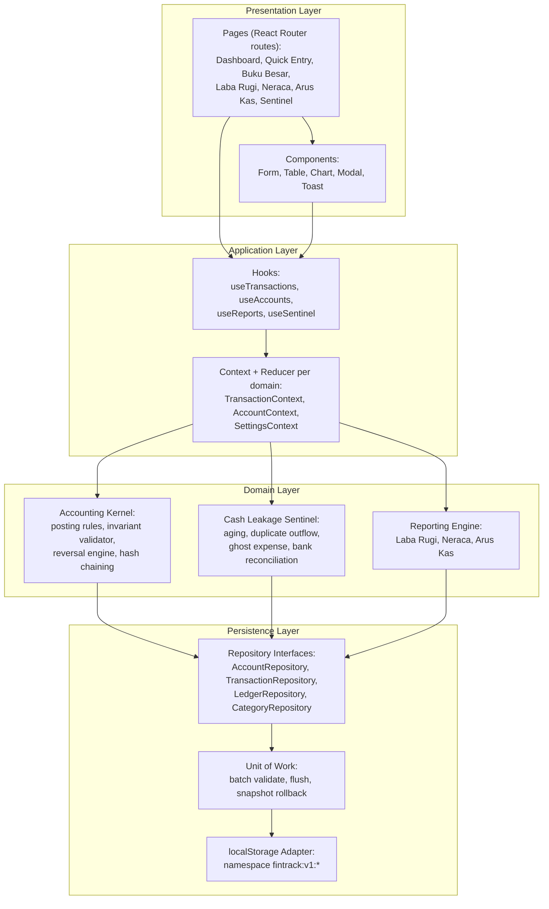

# Arsitektur — FinTrack Core

> Status: Final
> Terakhir diperbarui: 2026-09-19
> Pemilik: Office of the CTO

Dokumen ini menjelaskan arsitektur perangkat lunak FinTrack Core: SPA React +
TypeScript + Vite + Tailwind, tanpa backend, dengan persistensi `localStorage`
saja, dideploy sebagai situs statis ke Cloudflare Pages. Rujukan teknologi
lengkap ada pada [04_TRD.md](04_TRD.md); aturan akuntansi yang diimplementasikan
kernel domain ada pada [22_ACCOUNTING_SPEC.md](22_ACCOUNTING_SPEC.md).

## 1. Diagram Lapisan (Layered Architecture)



Batasan tegas: komponen Presentation tidak pernah memanggil Domain atau
Persistence secara langsung — selalu melalui Application (hooks/context).
Domain tidak pernah mengakses `localStorage` secara langsung — selalu melalui
Repository (TR-001).

## 2. Diagram Sekuens — Catat Transaksi

Alur "catat transaksi" dari form Quick Entry (FR-001) sampai baris ledger
di-commit, termasuk validasi invarian double-entry dan penegakan atomic
commit emulation (TR-002, TR-003).

```mermaid
sequenceDiagram
    participant U as Pengguna
    participant F as QuickEntryForm (Presentation)
    participant H as useTransactions (Application)
    participant K as AccountingKernel (Domain)
    participant S as CashLeakageSentinel (Domain)
    participant R as TransactionRepository (Persistence)
    participant UOW as UnitOfWork
    participant LS as localStorage Adapter

    U->>F: Isi tipe, nominal, akun, kategori
    F->>F: Validasi input klien (nominal > 0, field wajib)
    F->>H: submitTransaction(input)
    H->>K: buildLedgerEntries(input)
    K->>K: Terapkan aturan posting per tipe mutasi<br/>(22_ACCOUNTING_SPEC.md bagian 2)
    K->>K: Hitung SUM(Debit) - SUM(Credit)
    alt delta != 0
        K-->>H: throw LedgerImbalanceError
        H-->>F: Tampilkan galat
        F-->>U: Notifikasi gagal, tidak ada perubahan tersimpan
    else delta == 0
        K->>K: Hitung entry_hash berantai (prev_hash + payload)
        K-->>H: ledgerEntries[] siap commit
        H->>R: saveTransaction(transaction, ledgerEntries)
        R->>UOW: begin(); stage(transaction); stage(ledgerEntries)
        UOW->>UOW: Ambil snapshot state sebelum mutasi
        UOW->>LS: flush koleksi transactions, ledger_entries, meta.sequence
        alt flush gagal (mis. kuota localStorage penuh)
            UOW->>LS: restore snapshot sebelum mutasi
            UOW-->>R: throw PersistenceError
            R-->>H: propagate error
            H-->>F: Tampilkan galat penyimpanan
        else flush sukses
            UOW-->>R: commit sukses
            R-->>H: transaction tersimpan
            H->>S: evaluate(transaction)
            S-->>H: peringatan sentinel (jika ada)
            H-->>F: sukses + peringatan opsional
            F-->>U: Konfirmasi tersimpan (< 3 detik)
        end
    end
```

## 3. Tabel Komponen dan Tanggung Jawab

| Komponen | Lapisan | Tanggung Jawab |
|---|---|---|
| Pages (`src/pages`) | Presentation | Merangkai komponen per rute, mengikat ke hooks, tanpa logika bisnis. |
| Components (`src/components`) | Presentation | Elemen UI reusable (form, tabel, grafik, modal); menerima data via props. |
| Hooks (`src/hooks`) | Application | Menjembatani UI dan domain: memanggil kernel/sentinel/reporting, mengelola status loading/error. |
| Context + Reducer (`src/hooks` atau `src/context`) | Application | Menyimpan state domain di memori (daftar akun, transaksi, preferensi tema) dan mendistribusikannya ke komponen. |
| Accounting Kernel (`src/domain/kernel`) | Domain | Menerapkan aturan posting (bagian 2 pada [22_ACCOUNTING_SPEC.md](22_ACCOUNTING_SPEC.md)), memvalidasi invarian Debit=Credit, menghasilkan hash berantai, menerbitkan reversal. |
| Cash Leakage Sentinel (`src/domain/sentinel`) | Domain | Aging receivables, duplicate outflow, ghost expense tagging, bank reconciliation. |
| Reporting Engine (`src/domain/reporting`) | Domain | Menghitung Laba Rugi, Neraca, Arus Kas dari baris ledger sesuai formula agregasi. |
| Repository Interfaces (`src/repositories`) | Persistence | Kontrak akses data (`AccountRepository`, `TransactionRepository`, `LedgerRepository`, `CategoryRepository`); satu-satunya titik akses domain ke data. |
| Unit of Work (`src/repositories/unitOfWork.ts`) | Persistence | Mengumpulkan mutasi multi-koleksi di memori, memvalidasi, flush berurutan, dan memulihkan snapshot bila gagal (TR-002). |
| localStorage Adapter (`src/repositories/localStorageAdapter.ts`) | Persistence | Operasi baca/tulis mentah ke `localStorage` dengan namespace `fintrack:v1:*`, serialisasi JSON, dan pemantauan kuota (TR-010). |

## 4. Alur Data & Unit-of-Work / Atomic Commit Emulation

`localStorage` tidak menyediakan transaksi database, sehingga FinTrack Core
mengemulasikan atomic commit melalui pola unit-of-work di lapisan Persistence
(TR-002):

1. **Staging di memori:** Repository mengumpulkan seluruh objek yang akan
   ditulis (header transaksi, baris ledger, pembaruan `sequence_num`) ke
   dalam satu unit-of-work tanpa menyentuh `localStorage`.
2. **Validasi pra-flush:** Domain kernel memvalidasi invarian
   `SUM(Debit) - SUM(Credit) = 0` (bagian 4 pada
   [22_ACCOUNTING_SPEC.md](22_ACCOUNTING_SPEC.md)) sebelum unit-of-work
   diizinkan melakukan flush. Kegagalan validasi membatalkan seluruh operasi
   tanpa menyentuh penyimpanan sama sekali.
2. **Snapshot:** Sebelum menulis, unit-of-work menyalin state koleksi yang
   akan diubah (misalnya `fintrack:v1:transactions`,
   `fintrack:v1:ledger_entries`, `fintrack:v1:meta:sequence`) ke memori
   sebagai titik pulih.
4. **Flush berurutan:** Setiap koleksi yang terpengaruh ditulis ke
   `localStorage` satu per satu melalui adapter.
5. **Rollback atas kegagalan:** Jika satu langkah flush gagal (mis. kuota
   penuh, `QuotaExceededError`), unit-of-work menulis kembali snapshot
   sebelum mutasi ke seluruh koleksi yang sempat berubah, sehingga state
   `localStorage` kembali konsisten seperti sebelum operasi dimulai.
6. **Idempotensi:** Setiap transaksi membawa `client_tx_id` unik (TR-008).
   Penyimpanan ulang dengan `client_tx_id` yang sama dideteksi oleh
   repository sebelum staging dan dikembalikan sebagai no-op sukses, tanpa
   duplikasi baris ledger.
7. **Indeks di memori:** Pada bootstrap aplikasi, repository membangun indeks
   `Map` (ledger per akun, transaksi per periode) dari data `localStorage`
   agar pembacaan laporan tidak memindai seluruh koleksi (TR-009).

Karena seluruh operasi berjalan sinkron di satu tab browser tanpa proses
konkuren lain yang menulis ke `localStorage` yang sama, pola ini memberikan
jaminan atomicity yang setara dengan transaksi database untuk kasus
penggunaan aplikasi ini, tanpa memerlukan database sungguhan.

## 5. Struktur Folder `src/`

```
src/
├── domain/
│   ├── kernel/          # Accounting kernel: posting rules, invariant validator,
│   │                     # reversal engine, hash chaining (murni, tanpa dependensi React)
│   ├── sentinel/        # Cash Leakage Sentinel: aging, duplicate outflow,
│   │                     # ghost expense, bank reconciliation
│   └── reporting/       # Formula Laba Rugi, Neraca, Arus Kas
├── repositories/
│   ├── interfaces/      # Kontrak repository (TypeScript interface)
│   ├── unitOfWork.ts    # Unit-of-work: staging, validasi, flush, rollback
│   └── localStorageAdapter.ts  # Adapter mentah ke localStorage (namespace fintrack:v1:*)
├── hooks/                # useTransactions, useAccounts, useReports, useSentinel, dst.
├── pages/                 # Rute React Router: Dashboard, QuickEntry, Ledger,
│                          # ProfitLoss, BalanceSheet, CashFlow, Sentinel, Settings
├── components/            # Komponen UI reusable (form, tabel, grafik, modal, toast)
├── lib/                   # Util lintas lapisan: UUIDv7 lokal, util tanggal,
│                          # wrapper Web Crypto (SHA-256), formatter rupiah
└── styles/                # Tailwind config/entry, token CSS custom properties
```

Aturan dependensi: `domain/` tidak boleh mengimpor dari `pages/`,
`components/`, atau `hooks/`. `repositories/` tidak boleh mengimpor dari
`domain/` (arah dependensi domain → repositories, bukan sebaliknya, melalui
interface repository). `lib/` hanya berisi fungsi murni tanpa dependensi
lapisan lain.

## 6. Catatan Penyimpangan dari Arsitektur Asli

Spesifikasi awal pada [plan.md](../plan.md) bagian 4 mensyaratkan client
Flutter/React Native dengan SQLite lokal, sinkronisasi delta ke PostgreSQL 16
melalui API gateway (Fastify/Go), idempotensi berbasis Redis, dan replikasi
multi-perangkat. Pemilik proyek menetapkan arsitektur klien-saja:

| Aspek Asli (plan.md) | Realisasi FinTrack Core | Konsekuensi |
|---|---|---|
| Flutter/React Native + SQLite | SPA React + TypeScript + Vite | Tidak ada aplikasi mobile native; hanya web responsif. |
| PostgreSQL 16 + delta sync | `localStorage` per browser, tanpa sinkronisasi | Data tidak tersinkron antar perangkat (F-18 "Tidak untuk v1"); lihat NFR-005 ekspor JSON sebagai mitigasi. |
| Backend API (Fastify/Go) + PgBouncer | Tidak ada backend; seluruh logika berjalan di klien | Tidak ada endpoint jaringan; TR-042 operasi offline penuh terpenuhi secara struktural. |
| Redis idempotency lock store | `client_tx_id` unik dicek di repository lokal (TR-008) | Idempotensi hanya berlaku dalam satu instance browser/localStorage, bukan lintas perangkat. |
| Trigger database untuk imutabilitas ledger | Repository hanya mengekspos `append`/`read` (TR-004) | Penegakan imutabilitas berada di lapisan aplikasi, bukan di lapisan database. |
| WAL archiving, RPO/RTO server-side | Ekspor JSON manual oleh pengguna (NFR-005) | Ketahanan data bergantung pada kedisiplinan pengguna melakukan ekspor. |

Pemetaan lengkap beserta justifikasi dan risiko tercatat pada
[11_DECISIONS.md](11_DECISIONS.md) (ADR-001 sampai ADR-004) dan
[10_RISK_REGISTER.md](10_RISK_REGISTER.md). Deployment sebagai situs statis
ke Cloudflare Pages dengan SPA fallback (`public/_redirects`) diatur pada
TR-013 di [04_TRD.md](04_TRD.md).

## 7. Referensi

- [plan.md](../plan.md) — PRD asli.
- [01_PRD.md](01_PRD.md), [03_FRD.md](03_FRD.md), [04_TRD.md](04_TRD.md).
- [22_ACCOUNTING_SPEC.md](22_ACCOUNTING_SPEC.md) — spesifikasi akuntansi yang
  diimplementasikan oleh Accounting Kernel.
- [11_DECISIONS.md](11_DECISIONS.md) — Architecture Decision Records.
- [20_DATABASE.md](20_DATABASE.md) — skema penyimpanan `localStorage`.
